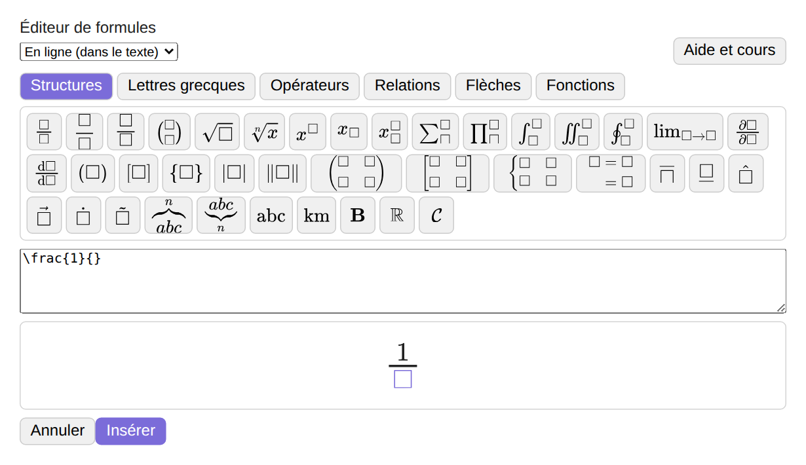
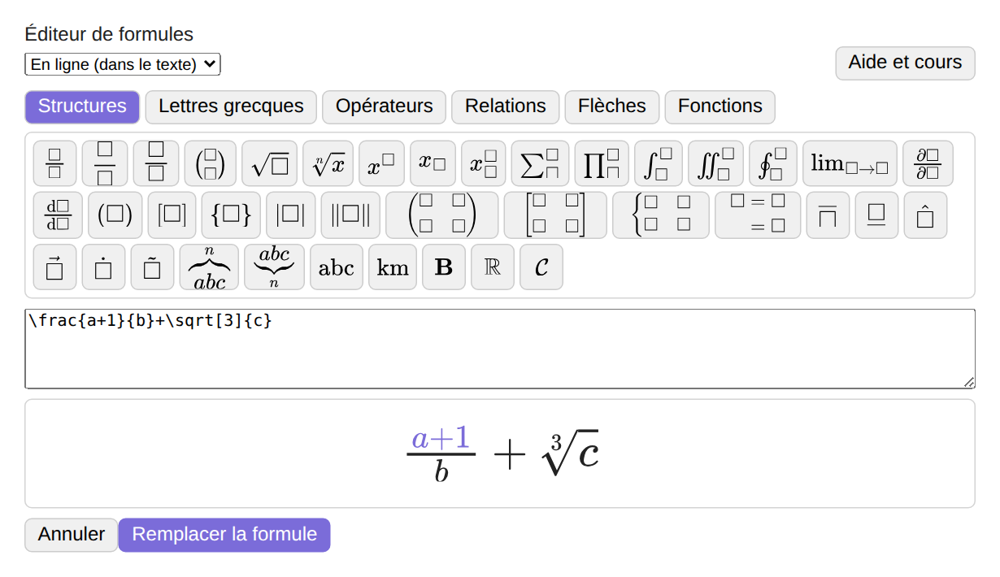
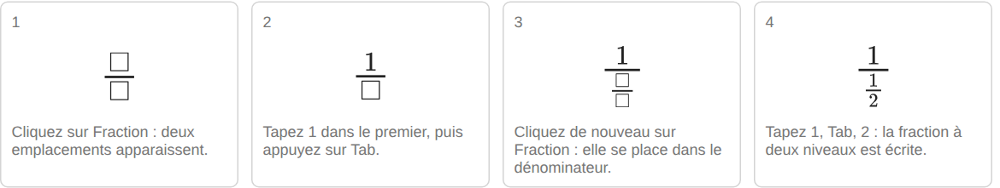

# Bigorneau

Bigorneau transforme une note Obsidian en document long. Chaque titre est un nœud d'une carte mentale qui porte un véritable paragraphe : on planifie, on déplace et on réorganise les chapitres visuellement, puis on les rédige sur place. Quand la structure est la bonne, une seule commande exporte un PDF composé. Le moteur de mise en page suit les algorithmes de TeX : coupure de lignes optimale, césure automatique, règles de la typographie française, notes de bas de page, tableaux et figures légendés, table des matières, renvois et formules. Aucune installation de LaTeX n'est nécessaire. Il est fait pour les rapports universitaires et tout long texte comportant de nombreuses sections.

Une version anglaise de ce fichier est disponible dans [README.md](README.md).

## Installation

Bigorneau est en cours de soumission au répertoire des plugins communautaires d'Obsidian. En attendant qu'il y figure, on l'installe avec le plugin BRAT :

1. Installer le plugin communautaire BRAT dans Obsidian.
2. Lancer la commande « BRAT: Add a beta plugin for testing ».
3. Saisir `Bigorneau15652/bigorneau`.
4. Activer Bigorneau dans Réglages, Plugins communautaires.

L'interface existe en français et en anglais. Elle suit la langue d'Obsidian par défaut, et la langue se choisit dans les réglages du plugin. Le compositeur de documents longs n'est disponible que sur ordinateur. La carte et la vue Liste fonctionnent sur tous les appareils.

Si vous utilisiez ce plugin sous son ancien nom, Mindmap Note Writing, désactivez l'ancien plugin avant d'activer Bigorneau. Bigorneau reprend les réglages de l'ancien plugin au premier démarrage.

## Écrire avec la carte

La carte de la note active s'ouvre avec l'icône du ruban ou avec la commande « Ouvrir la carte de la note active ». La première case de la carte porte le nom de la note, et chaque titre Markdown est un chapitre. Tab crée un sous-titre, Entrée crée un titre de même niveau et Suppr supprime un titre après confirmation. Un double clic ou F2 sur une case ouvre une petite fenêtre avec le titre, un titre court qui n'apparaît que sur la carte, un commentaire et des étiquettes. Glisser une case, ou utiliser Cmd ou Ctrl avec Maj et les flèches, la déplace avec sa branche. Cmd ou Ctrl avec C, X et V copient, coupent et collent des titres en Markdown. Cmd ou Ctrl avec Maj et Entrée fait l'aller-retour entre la carte et la note.

Les étiquettes ont un nom, une couleur de fond et une couleur de texte, en nombre illimité. Elles se définissent dans le menu de la carte et n'apparaissent que sur la carte. Le titre court, le commentaire et les étiquettes d'un titre sont conservés dans un commentaire invisible sous le titre. Les commentaires du plugin de la forme `%% mmw ... %%` sont masqués dans la note et protégés contre une suppression accidentelle.

L'œil qui apparaît au survol d'une case masque le titre et ses sous-titres dans la note. Le texte reste dans le fichier et les cases restent sur la carte, grisées. Le menu burger permet aussi de n'afficher que le chapitre actif dans la note, au lieu de griser les autres.

Les liens entre titres s'écrivent avec le bouton en forme de chaîne : il écrit un lien `[[Note#Titre cible|Lien vers Titre cible]]` au début du texte du titre de départ et trace une flèche en pointillé vers la cible. La même fenêtre cherche dans les notes du coffre, donc un lien peut viser une autre note, qui apparaît alors dans une case à gauche de la carte. Une mappemonde apparaît sur un titre dont le paragraphe contient des liens web ou des vidéos intégrées, et un clic ouvre la page.

La vue Liste condense la carte en un titre par ligne, décalé selon son niveau, avec un triangle pour replier les enfants et le même glisser-déposer pour réorganiser les titres. La liste s'ouvre dans un volet étroit à gauche de la note (on l'ajuste à la souris si besoin) et n'a pas de cadre propre : elle ne se déplace ni ne se zoome, le titre de la note reste en haut, une glissière, la molette de la souris et les flèches du clavier font apparaître les lignes du bas, et un titre plus long qu'une ligne est coupé par des points de suspension (le titre complet s'affiche au survol). La zone des titres flottants garde toujours environ trois lignes libres. On bascule avec le bouton de la barre de commandes ou avec la commande « Basculer entre la vue Mindmap et la vue Liste ».

Une note fixe copie le chapitre sélectionné dans son propre volet, au-dessus de la note dynamique qui suit la carte. On l'ajoute avec « Ajouter une note fixe » dans le menu burger ou avec la commande du même nom. Les sujets flottants sont des notes libres rattachées à aucun chapitre : un double clic sur le fond de la carte en crée un, et on peut le déposer près de la structure pour l'intégrer à la carte. Le panneau Apparence propose six formes pour les cases, des couleurs, des types de ligne et l'alignement du texte, appliqués à toute la carte, à un niveau ou à un seul titre. Un point d'interrogation en bas à droite de la carte ouvre un panneau d'aide avec les raccourcis.

## Compositeur de documents longs

Le bouton « Aperçu et export PDF de la note » du panneau de la note ouvre à côté de la note un volet qui montre la note en pages A4, et son bouton « Exporter en PDF… » écrit le PDF dans le coffre, par défaut dans le dossier de la note, en demandant confirmation avant de remplacer un fichier. L'aperçu et le PDF viennent de la même description des pages, ils sont donc identiques. Les titres masqués, les sujets flottants et les commentaires du plugin ne sont pas exportés.

Le texte est composé avec l'algorithme de coupure de lignes de Knuth et Plass, avec la césure française ou anglaise britannique (ajouter `lang: en` aux propriétés de la note pour l'anglais) et les règles de la typographie française : espace fine insécable avant le point-virgule, le point d'exclamation et le point d'interrogation, espace insécable avant les deux-points et à l'intérieur des guillemets, après les abréviations et entre un nombre et son unité. La ponctuation et les traits d'union en bout de ligne dépassent légèrement dans la marge, ce qui se désactive dans les réglages. La police est Libertinus Serif, avec Libertinus Mono pour le code, incorporées au PDF.

Les pages évitent les lignes veuves et orphelines, gardent un titre avec son texte, placent les notes de bas de page en bas de la page de leur appel avec un filet et un report sur la page suivante si nécessaire, et montrent le titre du chapitre en cours en en-tête et le numéro de page en pied de page. Le PDF contient un texte sélectionnable, des signets hiérarchiques qui suivent les titres, des liens cliquables et des métadonnées : titre, langue, date et auteur, pris dans la propriété `author` de la note ou dans les réglages du plugin.

Le gras, l'italique et les liens sont composés dans le texte. Les notes de bas de page s'écrivent `[^id]` avec une définition `[^id]: texte` n'importe où dans la note, ou directement `^[texte]`.

Un tableau Markdown est composé dans un style sobre : un filet au-dessus, un filet sous la ligne d'en-tête, un filet en bas, un en-tête en gras et pas de quadrillage. La largeur des colonnes s'adapte au contenu, le texte des cellules passe à la ligne comme un paragraphe, l'alignement des colonnes vient de la ligne de séparation (`:--`, `:-:`, `--:`), et un tableau long est coupé entre deux lignes avec son en-tête répété sur la page suivante. Une ligne qui commence par `Tableau :` ou `Table:` juste au-dessus d'un tableau en est la légende, numérotée automatiquement.

Le bouton « Insérer un tableau » ouvre une petite fenêtre avec une grille de 9 cases sur 9 : on la survole depuis la case en haut à gauche et on clique pour choisir le nombre de lignes et de colonnes. Trois interrupteurs ajoutent une ligne d'en-tête foncée à écriture blanche, une alternance de lignes légèrement contrastée, et une ligne pour le nom du tableau, écrite au-dessus du tableau (`Tableau :`). Les choix sont gardés dans une ligne de commentaire au-dessus du tableau (`%% mmw-table {...} %%`, invisible en lecture) : l'aperçu en direct et la lecture montrent le style, et l'export PDF le reproduit, avec des colonnes de même largeur. Dans l'aperçu en direct, un petit triangle apparaît au survol du bord droit et du bord bas d'un tableau pour ajouter une colonne ou une ligne, et un clic droit sur une cellule ouvre un menu pour insérer, supprimer et déplacer des lignes et des colonnes, aligner une colonne, et changer le style et le nom. Les mêmes actions existent en mode Source (clic droit) et dans la palette de commandes.

Dans l'export PDF, chaque ligne de texte est un paragraphe : un simple retour à la ligne, une ligne vide ou plusieurs lignes vides donnent la même mise en page.

Le bouton LI génère du texte Lorem ipsum : il demande la taille des paragraphes en lignes (`6` : un paragraphe de 6 lignes ; `6,4,2` : trois paragraphes de 6, 4 et 2 lignes, d'environ 90 caractères par ligne). Dans l'aperçu en direct, la légende « Figure N : Nom » s'affiche sous une figure nommée et le numéro des tableaux nommés dans leur ligne « Tableau : Nom ».

Un dessin Excalidraw s'écrit comme une figure (`![[schema.excalidraw|Nom du dessin]]`) et s'imprime par son export image (export automatique en SVG ou PNG à activer dans Excalidraw). Le bouton Dessiner crée un dessin Excalidraw, l'intègre à la note et demande son nom ; le bouton d'insertion d'image place une image ou un dessin du coffre avec son nom. Une figure sans nom n'a ni légende ni numéro. La légende se place sous la figure ou au-dessus (réglage de l'export).

Une figure est une image écrite `![[plan.png|Légende]]`, ou `![[plan.png|Légende|400]]` avec une largeur en pixels. Les formats PNG, JPEG, WebP, GIF et SVG sont acceptés, réduits à 300 points par pouce au plus de la taille affichée (les JPEG en couleurs sont repris tels quels). La légende s'affiche « Figure 1 : Légende ». Une image introuvable, ou une image du web qui n'est jamais téléchargée, est remplacée par un repère visible et signalée dans le compte rendu de l'export. Les figures et les tableaux légendés flottent comme en LaTeX, en haut ou en bas de la page où ils tiennent, sauf si le réglage demande de les garder là où ils sont écrits.

Une table des matières est ajoutée sous le titre quand la note a la propriété `toc: true` ou quand les réglages la demandent. `toc-depth: 2` limite les niveaux. Les numéros de page sont calculés après la mise en page définitive, avec des points de conduite et des entrées cliquables. `chapter-toc: true` ajoute au début de chaque chapitre de plus haut niveau une table des matières qui ne liste que ses sous-titres, avec `chapter-toc-depth: 3` pour régler ses niveaux. Les propriétés d'une note l'emportent sur les réglages.

Le script Mise en page (désactivé par défaut) ajoute d'abord un bouton Format de la page : feuille (A3, A4, A5, A6, B5, lettre et légal américains, livres 6 x 9 et 5,5 x 8,5 pouces), portrait ou paysage, marges étroites, normales ou larges, et une à plusieurs colonnes selon la largeur de la feuille (une colonne garde au moins 4,6 cm ; les notes de bas de page se placent au bas de leur colonne). Il ajoute aussi un bouton qui ouvre une fenêtre à trois onglets : En-tête, Pied de page et Bord extérieur, qui fonctionnent de la même manière (le texte du bord extérieur est écrit à 90 degrés). Les réglages sont propres à chaque note, écrits dans une ligne de commentaire `%% mmw-page {...} %%` sous les propriétés. Une bande apparaît dès qu'une zone est remplie : trois zones de trois lignes au plus, avec gras, italique, quatre tailles, valeurs variables (`{document}`, `{chapter}`, `{section}`, `{author}`, `{date}`, `{page}`, `{pages}`), images et dessins Excalidraw du coffre (`![[logo.png|200]]`, largeur en pixels, 300 pixels de large et 60 de haut au plus, proportions conservées), et des pages de gauche pouvant différer de celles de droite. Le numéro de page s'écrit `{page}` dans n'importe quelle zone, avec, par bande, une forme (rond, carré, coins arrondis) et des couleurs derrière le numéro. Chaque zone peut aussi avoir un cadre de couleur ajusté à son texte (onglets colorés sur le bord, par exemple), et un éloignement en millimètres règle la distance au bord de la page. Un bouton Paragraphes règle pour toute la note le début des paragraphes (retrait de la première ligne, ou espace S, M ou L de 4, 8 et 14 points sans retrait) et leur alignement (justifié, à gauche, à droite, centré), avec, par un bouton distinct, une exception possible pour le seul paragraphe du curseur, posée par une étiquette cachée `%% p: droite, espace m %%` au début de sa ligne. La fenêtre Format de la page montre un schéma à l'échelle de la feuille, des marges et des colonnes. Un bouton Orientation de la page fait passer un bloc (grand tableau, grande image) en paysage ou en portrait, avec son propre nombre de colonnes, par une étiquette cachée `%% page: paysage, 2 colonnes, seulement %%` écrite avant le bloc. Un bouton Listes des figures et des tableaux place, à l'endroit du curseur, une étiquette cachée `%% liste: figures %%` ou `%% liste: tableaux %%` : à l'export, la liste correspondante apparaît à cet endroit avec le numéro de page de chaque figure ou tableau nommé.

Renvois : `[[#Titre]]` devient un lien cliquable vers le titre. Pour viser une figure ou un tableau, ajouter un identifiant de bloc en fin de ligne, par exemple `![[plan.png|Plan]] ^plan`, ou `^conso` seul sur la ligne après un tableau, puis écrire `[[#^plan]]`, qui s'affiche « Figure 1 ». Un réglage ajoute « (page N) » après le texte du renvoi.

Les formules s'écrivent `$formule$` dans le texte et `$$formule$$` sur leurs propres lignes. Elles sont dessinées par la bibliothèque MathJax intégrée au plugin et écrites dans le PDF en dessin vectoriel, donc nettes à tout agrandissement. Cela relève du script Formules, désactivé par défaut (voir Scripts plus bas) : sans lui, les formules restent écrites telles quelles dans le PDF. Une formule refusée par MathJax est gardée telle qu'elle est écrite et signalée.

Une vidéo, un son, un PDF intégré ou un contenu web intégré ne se lit pas sur papier. Chacun est remplacé par un cadre qui donne sa sorte, son titre et son adresse, cliquable dans le PDF quand c'est une adresse web. Un réglage remplace le cadre par une simple ligne de texte.

Les réglages du chapitre « Export PDF » couvrent l'auteur du PDF, l'en-tête, le pied de page, l'alignement des pages en bas, le saut de page avant chaque chapitre, la numérotation des notes de bas de page, la protrusion, les tables des matières, la place des figures et des tableaux, les renvois et les médias. Trois commandes de la palette écrivent dans la note, et chacune peut recevoir un raccourci clavier dans les réglages d'Obsidian : insérer une note de bas de page, activer ou désactiver la table des matières de la note et insérer une légende de tableau. Quand le script Formules est activé, un bouton d'éditeur de formules apparaît, et les commandes « Insérer une formule en ligne » et « Insérer une formule en bloc » ouvrent ce même éditeur. C'est une fenêtre avec des palettes par onglets (structures comme les fractions à plusieurs niveaux, racines, exposants, sommes, intégrales et matrices, puis lettres grecques, opérateurs, relations, flèches et fonctions), une zone de saisie en TeX et un aperçu en direct. Si le curseur est dans une formule, l'éditeur l'ouvre et la remplace à la validation. Un double clic sur un élément de l'aperçu sélectionne la partie correspondante du texte TeX (un clic de plus sélectionne la partie plus grande qui l'entoure), et Suppr efface cette partie en entier : on corrige donc une formule sans lire le TeX. Un bouton d'aide de l'éditeur ouvre un cours illustré sur les palettes et le rôle de chaque bouton, avec des exemples pas à pas.

L'aperçu est aussi un éditeur visuel : après un clic dedans, un curseur clignote dans la formule et le clavier agit sur la formule elle-même. Les flèches gauche et droite se déplacent d'un symbole à la fois, en entrant et en sortant des fractions, exposants et racines ; les flèches haut et bas vont du dénominateur au numérateur, de l'exposant à la base ; Tab saute à l'emplacement vide suivant, montré par un petit carré. Un clic sur un carré y place le curseur, ce qui permet d'écrire sous une barre de fraction. Les chiffres, lettres et signes se tapent directement, `^` et `_` ouvrent un exposant ou un indice, et `/` transforme ce qui précède en numérateur d'une fraction. Dans la zone de saisie, les flèches se déplacent dans le texte TeX comme d'habitude.

Les images ci-dessus montrent l'éditeur tel que le dessine le plugin ; les couleurs suivent le thème d'Obsidian utilisé.

## Panneau de boutons et aide

Un panneau de petits boutons se trouve à droite de la zone de rédaction, au milieu de la hauteur, dans tous les éditeurs de notes. Le premier bouton, l'icône bigorneau, ouvre la fenêtre des scripts. Le bouton d'aide ouvre une fenêtre qui offre une zone de recherche et fonctionne hors connexion, en français ou en anglais selon la langue du plugin. Les autres boutons sont les fonctions du plugin : les commandes qui écrivent dans la note, puis l'aperçu et l'export PDF, réunis dans un seul bouton. Chaque fonction est aussi une commande de la palette de commandes, où l'on peut lui attribuer un raccourci clavier dans les réglages d'Obsidian. Un clic long sur un bouton, puis un glissement, le déplace, et l'ordre est conservé. La fenêtre du bouton bigorneau permet de masquer un bouton, de les déplacer et d'ajouter des séparations. Le chapitre « Panneau de boutons » des réglages affiche ou masque le panneau, masque un bouton, déplace les boutons en glissant leur poignée, et ajoute ou supprime des séparations entre groupes de boutons ; seul le bouton bigorneau ne se modifie pas. La commande « Afficher ou masquer le panneau de boutons » bascule le panneau. Sur tablette et téléphone, le panneau est masqué par défaut, et un réglage l'affiche. Les fonctions qui écrivent dans la note ne marchent qu'en mode édition.

## Scripts

Les scripts ajoutent des fonctions à Bigorneau : chacun apporte ses boutons et ses commandes. Le bouton bigorneau, en haut du panneau, ou la commande « Ouvrir les scripts de Bigorneau », ouvre la fenêtre des scripts, où l'on active ou désactive chaque script. Désactiver un script le rend inactif tout de suite, mais son code ne se décharge qu'au redémarrage d'Obsidian. Le script Formules est intégré au plugin et désactivé par défaut : un nouvel utilisateur l'active pour obtenir les formules dans le PDF et les deux commandes de formule.

On peut aussi ajouter un script écrit à la main : un fichier JavaScript qui commence par un commentaire d'en-tête. Le bouton « Choisir un fichier » de la fenêtre des scripts ouvre le sélecteur de fichiers de l'ordinateur, et le fichier est copié dans le dossier technique du plugin (`.obsidian/plugins/bigorneau/scripts`). Avant son premier lancement, un script est présenté avec son nom, son origine et une empreinte de son contenu, et il faut le confirmer. Si le fichier change, il faut le confirmer de nouveau. Un script a les mêmes pouvoirs que le plugin lui-même : il peut lire et modifier toutes vos notes et, sur ordinateur, accéder aux fichiers de la machine. N'ajoutez donc que des scripts dont vous connaissez l'origine. Le format d'un script et l'interface qu'il reçoit sont décrits dans [docs/SCRIPTS.md](docs/SCRIPTS.md).

## Confidentialité et divulgations

Bigorneau ne se connecte pas à Internet. Il n'a ni télémétrie, ni publicité, ni compte, ni paiement. Il ne lit et n'écrit des fichiers que dans votre coffre et dans son dossier technique, hormis un fichier de script que vous choisissez vous-même avec le sélecteur de fichiers de la fenêtre des scripts. Les scripts ajoutés à la main ne s'exécutent qu'après votre confirmation. Les liens ne s'ouvrent dans votre navigateur que lorsque vous cliquez dessus, et les images du web ne sont pas téléchargées pour l'export.

## Crédits et licences

Bigorneau est publié sous licence MIT (voir [LICENSE](LICENSE)). Le compositeur de documents longs embarque les œuvres suivantes, dont les licences se trouvent dans le dossier [licences](licences) et dans [NOTICE](NOTICE) :

- Les polices Libertinus Serif et Libertinus Mono, version 7.051, copyright 2012-2024 The Libertinus Project Authors, licence SIL Open Font License 1.1.
- La bibliothèque MathJax, version 3.2.2, copyright The MathJax Consortium, licence Apache 2.0.
- Les motifs de césure du français (Daniel Flipo, Bernard Gaulle, Arthur Reutenauer) et de l'anglais britannique (Dominik Wujastyk, Graham Toal), licence MIT, du projet hyph-utf8.

L'algorithme de coupure de lignes (Knuth et Plass, 1981) et l'algorithme de césure (Liang, 1983) sont réimplémentés d'après leurs descriptions publiées, sans reprise de code.

## Développement

Le code est écrit en TypeScript. `npm install` installe les outils, `npm test` lance les tests et `npm run build` produit `main.js`. Les documents de conception sont dans le dossier [docs](docs).
